  

  
  
  
  

 

  

  I'm Omar, an IT &amp; networks engineer from Morocco. I build backend services with <b>Java</b> and <b>Spring Boot</b>,
  with a soft spot for clean architecture, well-designed REST APIs and systems that scale.

  

 

  

  <code>backend core</code>  
  

  <code>languages &amp; frameworks</code>  
  

  <code>cloud, data &amp; tools</code>  
  

 

  

  
  

  

 

  

  <picture>
    <source media="(prefers-color-scheme: dark)" srcset="https://raw.githubusercontent.com/xmarhm/xmarhm/output/snake-dark.svg" />
    <source media="(prefers-color-scheme: light)" srcset="https://raw.githubusercontent.com/xmarhm/xmarhm/output/snake-light.svg" />
    
  </picture>

 

  

  

